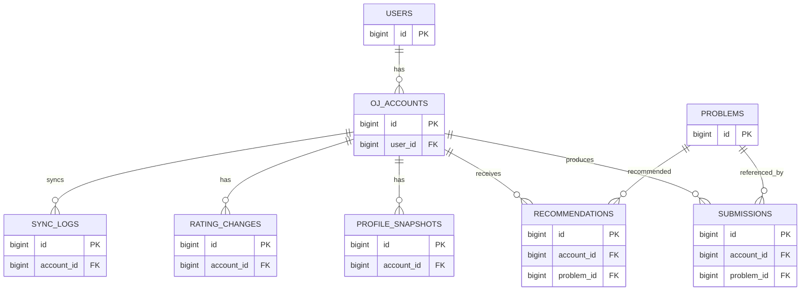

> 适用范围：CodeStartrail V0.1
> 核心闭环：外部账号 → 数据同步 → 提交记录 → 用户画像 → 题目推荐 → 前端展示
> 数据库：PostgreSQL
> 本文只描述逻辑模型，不包含完整建表 SQL。

---

## 1. 设计目标

V0.1 数据库只服务当前最核心流程：

```
用户填写 OJ 账号
        ↓
校验并绑定账号
        ↓
同步公开提交记录和题目信息
        ↓
保存标准化数据
        ↓
生成用户画像快照
        ↓
生成题目推荐
        ↓
前端展示画像和推荐结果
```

当前版本优先保证：

1. 数据能正确同步；
2. 重复同步不会产生重复记录；
3. 原始平台数据尽量保留；
4. 能支持基础画像分析；
5. 能支持基础题目推荐；
6. 结构可以扩展到更多 OJ，但不提前做复杂多平台系统。

---

# 2. 设计原则

## 2.1 原始值与归一化值分开

平台返回的原始字段尽量保留。

例如：

```
verdict_raw
verdict_category

language_raw
language_family
```

原始值用于追溯，归一化字段用于统一统计和推荐。

---

## 2.2 不重复存储可以实时计算的数据

例如：

- 当前难度分布
- 当前标签分布
- 当前活跃度

优先通过 `submissions + problems` 计算。

但是：

`profile_snapshots` 是历史画像快照，允许保存已经计算好的统计结果，因为其目的不是减少查询，而是保留“当时的用户状态”。

---

## 2.3 提交必须能关联题目

V0.1 保留：

```
submissions.problem_id -> problems.id
```

为非空外键。

如果某次提交对应的题目不存在于当前题库目录，则先根据提交信息创建一个最小 `problems` 占位记录，再写入提交。

因此：

```
题库接口没有题
≠
submission.problem_id 可以为空
```

而是：

```
提交发现未知题
↓
补建 problem
↓
写 submission
```

这样可以保证数据完整性。

---

## 2.4 推荐结果保留最小历史记录

V0.1 的核心功能包含题目推荐，因此保留推荐结果记录。

目的：

- 前端展示；
- 避免同一次请求结果无法追踪；
- 后续分析“推荐过什么题”；
- 后续评价推荐算法效果；
- 支持算法版本迭代。

不做复杂推荐系统，只保留最小必要字段。

---

# 3. 实体列表

| 实体                  | 说明                   | V0.1 |
| --------------------- | ---------------------- | ---- |
| `users`             | 系统内部用户           | P0   |
| `oj_accounts`       | 用户绑定的外部 OJ 账号 | P0   |
| `problems`          | 题目目录               | P0   |
| `submissions`       | 用户提交记录           | P0   |
| `profile_snapshots` | 用户能力画像历史快照   | P0   |
| `recommendations`   | 推荐给用户的题目记录   | P0   |
| `sync_logs`         | 数据同步执行记录       | P0   |
| `rating_changes`    | Rating 历史变化        | P1   |

`rating_changes` 对 Codeforces 画像有价值，但不阻塞最小推荐闭环。

---

# 4. users

V0.1 暂不实现完整账号登录系统，因此 `users` 只承担内部用户身份。

| 字段             | 类型        | 约束 | 说明            |
| ---------------- | ----------- | ---- | --------------- |
| `id`           | bigint      | PK   | 内部用户 ID     |
| `display_name` | varchar(64) | 可空 | 用户展示名称    |
| `role`         | varchar(16) | 非空 | 默认`STUDENT` |
| `created_at`   | timestamptz | 非空 |                 |
| `updated_at`   | timestamptz | 非空 |                 |

### role

```
STUDENT
COACH
ADMIN
```

V0.1 实际只使用 `STUDENT`。

未来正式实现账号系统时，再增加：

```
username
email
password_hash / third_party_auth_id
```

不建议现在把“登录账号体系”和“训练数据体系”混在一起实现。

---

# 5. oj_accounts

保存用户绑定的外部程序设计平台账号。

| 字段               | 类型         | 约束        | 说明                 |
| ------------------ | ------------ | ----------- | -------------------- |
| `id`             | bigint       | PK          |                      |
| `user_id`        | bigint       | FK → users |                      |
| `platform`       | varchar(32)  | 非空        | 平台                 |
| `external_id`    | varchar(128) | 非空        | 归一化后的账号标识   |
| `display_name`   | varchar(128) | 非空        | 平台返回的原始显示名 |
| `bind_status`    | varchar(16)  | 非空        | 默认`ACTIVE`       |
| `organization`   | varchar(256) | 可空        |                      |
| `country`        | varchar(128) | 可空        |                      |
| `registered_at`  | timestamptz  | 可空        | 平台注册时间         |
| `last_synced_at` | timestamptz  | 可空        | 最近一次成功同步时间 |
| `created_at`     | timestamptz  | 非空        |                      |
| `updated_at`     | timestamptz  | 非空        |                      |

### 唯一约束

```
(platform, external_id)
(user_id, platform)
```

含义：

- 同一个 OJ 账号不能绑定到两个内部用户；
- V0.1 每个内部用户在同一平台最多绑定一个账号。

### bind_status

```
ACTIVE
INVALID
DISABLED
```

不保留 `UNBOUND`。

如果账号没有绑定，就不存在 `oj_accounts` 记录。

---

# 6. problems

保存题目目录。

| 字段                     | 类型         | 约束             | 说明                |
| ------------------------ | ------------ | ---------------- | ------------------- |
| `id`                   | bigint       | PK               |                     |
| `platform`             | varchar(32)  | 非空             |                     |
| `external_problem_key` | varchar(128) | 非空             | 平台题目标识        |
| `title`                | varchar(256) | 可空             | 占位题可能暂时未知  |
| `difficulty`           | integer      | 可空             | 缺失时必须保持 NULL |
| `points`               | numeric      | 可空             |                     |
| `solved_count`         | integer      | 可空             | 平台通过人数        |
| `tags`                 | text[]       | 非空，默认空数组 | 平台原始标签        |
| `catalog_source`       | varchar(16)  | 非空             |                     |
| `url`                  | text         | 可空             | 前端跳转            |
| `first_seen_at`        | timestamptz  | 非空             |                     |
| `updated_at`           | timestamptz  | 非空             |                     |

### 唯一约束

```
(platform, external_problem_key)
```

### catalog_source

```
CATALOG
INFERRED
```

`INFERRED`：

题库接口中没有找到，但从用户提交记录中发现，因此系统自动补建。

推荐系统的候选题不能只依赖用户提交中出现过的题，需要定期同步平台题目目录，否则推荐池会严重不完整。

---

# 7. submissions

保存用户的每一次提交。

| 字段                       | 类型         | 约束                    | 说明                 |
| -------------------------- | ------------ | ----------------------- | -------------------- |
| `id`                     | bigint       | PK                      |                      |
| `account_id`             | bigint       | FK → oj_accounts，非空 |                      |
| `platform`               | varchar(32)  | 非空                    | 用于外部提交唯一约束 |
| `external_submission_id` | varchar(128) | 非空                    | 平台提交 ID          |
| `problem_id`             | bigint       | FK → problems，非空    |                      |
| `verdict_raw`            | varchar(64)  | 非空                    | 平台原始判定         |
| `verdict_category`       | varchar(32)  | 非空                    | 归一化判定           |
| `language_raw`           | varchar(128) | 可空                    | 平台原始语言         |
| `language_family`        | varchar(32)  | 可空                    | 归一化语言           |
| `participation_type`     | varchar(32)  | 非空                    | 参赛类型             |
| `time_ms`                | integer      | 可空                    |                      |
| `memory_kb`              | integer      | 可空                    |                      |
| `passed_test_count`      | integer      | 可空                    |                      |
| `submitted_at`           | timestamptz  | 非空                    |                      |
| `created_at`             | timestamptz  | 非空                    |                      |

### 唯一约束

```
(platform, external_submission_id)
```

保证重复同步不会插入同一条提交。

---

# 8. verdict_category

统一判定：

```
ACCEPTED
PARTIAL
WRONG_ANSWER
TIME_LIMIT
MEMORY_LIMIT
RUNTIME_ERROR
COMPILE_ERROR
SKIPPED
OTHER
```

平台原始值始终保存在：

```
verdict_raw
```

---

# 9. language_family

```
C
CPP
JAVA
PYTHON
KOTLIN
PASCAL
OTHER
```

实际编译器版本、语言完整名称保存在：

```
language_raw
```

---

# 10. participation_type

```
CONTESTANT
VIRTUAL
PRACTICE
OTHER
```

---

# 11. profile_snapshots

保存用户某一天生成的能力画像。

V0.1 画像按 OJ 账号计算。

| 字段                      | 类型        | 约束                    | 说明                     |
| ------------------------- | ----------- | ----------------------- | ------------------------ |
| `id`                    | bigint      | PK                      |                          |
| `account_id`            | bigint      | FK → oj_accounts，非空 |                          |
| `snapshot_date`         | date        | 非空                    | 建议统一 UTC             |
| `rating`                | integer     | 可空                    |                          |
| `max_rating`            | integer     | 可空                    |                          |
| `rank_title`            | varchar(64) | 可空                    |                          |
| `last_online_at`        | timestamptz | 可空                    |                          |
| `solved_count`          | integer     | 非空                    | AC 去重后的题数          |
| `accepted_count`        | integer     | 非空                    | ACCEPTED 提交次数        |
| `submission_count`      | integer     | 非空                    | 全部提交次数             |
| `unrated_solved_count`  | integer     | 非空                    | 无 difficulty 的 AC 题数 |
| `average_difficulty`    | numeric     | 可空                    | 已有难度题目的平均难度   |
| `max_solved_difficulty` | integer     | 可空                    | 已完成题最高难度         |
| `skill_scores`          | jsonb       | 非空                    | 知识点能力评分           |
| `profile_version`       | varchar(32) | 非空                    | 画像算法版本             |
| `created_at`            | timestamptz | 非空                    |                          |

### 唯一约束

```
(account_id, snapshot_date)
```

### skill_scores 示例

```json
{
  "dp": 0.42,
  "graph": 0.35,
  "greedy": 0.71,
  "math": 0.66
}
```

V0.1 使用简单统计 / 规则算法即可。

---

# 12. recommendations

保存实际推荐给用户的题目。

V0.1 不做复杂推荐系统，但需要保留最小推荐历史。

| 字段                  | 类型        | 约束                    | 说明                         |
| --------------------- | ----------- | ----------------------- | ---------------------------- |
| `id`                | bigint      | PK                      |                              |
| `account_id`        | bigint      | FK → oj_accounts，非空 |                              |
| `problem_id`        | bigint      | FK → problems，非空    |                              |
| `batch_id`          | uuid        | 非空                    | 同一次推荐请求使用相同 batch |
| `rank_position`     | integer     | 非空                    | 推荐顺序                     |
| `score`             | numeric     | 非空                    | 推荐分数                     |
| `reason_codes`      | jsonb       | 非空                    | 结构化推荐原因               |
| `reason_text`       | text        | 可空                    | 前端展示的自然语言说明       |
| `algorithm_version` | varchar(32) | 非空                    | 推荐算法版本                 |
| `generated_at`      | timestamptz | 非空                    |                              |

### reason_codes 示例

```json
[
  "WEAK_DP",
  "DIFFICULTY_MATCH"
]
```

### 推荐原则

V0.1 可以使用：

```
推荐分数
=
难度匹配
+
薄弱知识点匹配
+
标签匹配
```

数据库不负责计算推荐，只负责保存推荐结果。

---

# 13. rating_changes

Codeforces 等存在 Rating 的平台可以保存 Rating 历史。

该表属于 V0.1 P1，不阻塞核心功能。

| 字段             | 类型         | 约束                    | 说明 |
| ---------------- | ------------ | ----------------------- | ---- |
| `id`           | bigint       | PK                      |      |
| `account_id`   | bigint       | FK → oj_accounts，非空 |      |
| `contest_key`  | varchar(128) | 非空                    |      |
| `contest_name` | varchar(256) | 可空                    |      |
| `contest_rank` | integer      | 可空                    |      |
| `old_rating`   | integer      | 可空                    |      |
| `new_rating`   | integer      | 可空                    |      |
| `occurred_at`  | timestamptz  | 非空                    |      |

唯一约束：

```
(account_id, contest_key)
```

---

# 14. sync_logs

记录每次同步任务。

| 字段              | 类型        | 约束                    | 说明 |
| ----------------- | ----------- | ----------------------- | ---- |
| `id`            | bigint      | PK                      |      |
| `account_id`    | bigint      | FK → oj_accounts，可空 |      |
| `platform`      | varchar(32) | 非空                    |      |
| `started_at`    | timestamptz | 非空                    |      |
| `finished_at`   | timestamptz | 可空                    |      |
| `status`        | varchar(16) | 非空                    |      |
| `items_fetched` | integer     | 非空，默认 0            |      |
| `items_written` | integer     | 非空，默认 0            |      |
| `error_message` | text        | 可空                    |      |
| `created_at`    | timestamptz | 非空                    |      |

### status

```
RUNNING
SUCCESS
PARTIAL
FAILED
```

`RUNNING` 很重要，因为同步任务开始后到结束前需要有明确状态。

`PARTIAL` 用于：

- 用户信息获取成功；
- 但部分提交或题目同步失败。

---

# 15. 索引

## 唯一索引 / 唯一约束

```
oj_accounts(platform, external_id)

oj_accounts(user_id, platform)

problems(platform, external_problem_key)

submissions(platform, external_submission_id)

profile_snapshots(account_id, snapshot_date)

rating_changes(account_id, contest_key)
```

---

## 查询索引

| 表                  | 索引                           | 用途             |
| ------------------- | ------------------------------ | ---------------- |
| `submissions`     | `(account_id, submitted_at)` | 活跃度、近期提交 |
| `submissions`     | `(account_id, problem_id)`   | 单题尝试         |
| `submissions`     | ACCEPTED 部分索引              | 已完成题统计     |
| `rating_changes`  | `(account_id, occurred_at)`  | Rating 趋势      |
| `sync_logs`       | `(account_id, started_at)`   | 同步历史         |
| `recommendations` | `(account_id, generated_at)` | 推荐历史         |
| `recommendations` | `(batch_id, rank_position)`  | 单次推荐结果     |
| `problems`        | `tags GIN`                   | 标签查询         |

---

# 16. 画像派生指标

以下指标由：

```
submissions
+
problems
```

计算。

## 通过题数

```
COUNT(DISTINCT problem_id)
WHERE verdict_category = 'ACCEPTED'
```

## 通过次数

```
COUNT(*)
WHERE verdict_category = 'ACCEPTED'
```

## 难度分布

先按 `problem_id` 去重。

```
difficulty -> AC 题数
```

difficulty 为 NULL 的题单独统计。

必须满足：

```
各难度档题数之和
+
unrated_solved_count
=
solved_count
```

## 标签分布

一题可以有多个标签。

因此：

```
所有标签数量之和 > solved_count
```

是正常现象。

## 活跃度

```
UTC 日期 -> 当天提交次数
```

统计全部 submission，不只统计 ACCEPTED。

---

# 17. V0.1 暂不使用物化视图

当前 V0.1 数据量和用户量预计较小。

因此优先：

```
数据库索引
+
SQL 查询
+
Profile Service
```

完成画像计算。

暂时不引入：

```
Materialized View
+
每次同步刷新物化视图
```

原因：

- 增加同步流程复杂度；
- 增加刷新状态管理；
- 当前性能收益有限。

如果后续查询速度成为真实问题，再增加物化视图。

---

# 18. V0.1 数据同步流程

```
POST /accounts/{id}/sync
        ↓
创建 sync_log
status = RUNNING
        ↓
调用 Platform Provider
        ↓
获取用户数据
        ↓
获取 submissions
        ↓
补建缺失 problems
        ↓
upsert problems
        ↓
upsert submissions
        ↓
计算 profile
        ↓
写 profile_snapshot
        ↓
更新 oj_accounts.last_synced_at
        ↓
sync_log = SUCCESS
```

发生部分异常：

```
PARTIAL
```

完全失败：

```
FAILED
```

只有成功完成主要同步流程时才更新：

```
last_synced_at
```

---

# 19. V0.1 推荐流程

```
GET /users/{id}/recommendations
        ↓
读取最新 profile_snapshot
        ↓
获取候选 problems
        ↓
排除已经 AC 的题
        ↓
计算推荐分数
        ↓
选 Top K
        ↓
写 recommendations
        ↓
返回前端
```

V0.1 推荐算法先保持简单。

例如：

```
score
=
0.40 × difficulty_match
+
0.35 × weakness_match
+
0.25 × tag_match
```

实际权重由推荐算法实现决定，数据库不绑定具体公式。

---

# 20. ER 图



---

# 21. PostgreSQL 类型建议

| 逻辑类型   | PostgreSQL                           |
| ---------- | ------------------------------------ |
| ID         | `bigint generated ... as identity` |
| 时间戳     | `timestamptz`                      |
| 日期       | `date`                             |
| 字符串数组 | `text[]`                           |
| 结构化数据 | `jsonb`                            |
| 枚举       | `text + CHECK`                     |
| 推荐批次   | `uuid`                             |

V0.1 不建议使用 PostgreSQL 原生 ENUM。

原因：

未来：

- 增加平台；
- 增加判定类型；
- 增加语言类型；

修改 text + CHECK 通常比维护 PG enum 更灵活。

---

# 22. V0.1 当前不解决的问题

以下内容放到后续版本：

- 多平台统一标签体系；
- 多平台综合用户画像；
- 用户画像机器学习模型；
- 推荐算法机器学习化；
- 推荐反馈学习；
- 教练端；
- 完整登录认证；
- Redis；
- Celery / MQ；
- 微服务；
- 大规模题目向量检索；
- 推荐召回 / 排序多阶段架构。

---

# 23. 当前仍需确认

V0.1 开发前只需要确认以下几个问题：

1. 首发 OJ 平台是哪一个；
2. `skill_scores` 的第一版计算公式；
3. 推荐算法 V1 的评分规则；
4. 推荐 Top K 默认数量；
5. Profile 是同步结束立即生成，还是首次查看时生成。

除此之外，不建议继续扩大数据库设计范围。

---

# 24. V0.1 最小数据链路

最终数据库必须支撑这一条完整链路：

```
users
  ↓
oj_accounts
  ↓
submissions ← problems
  ↓
profile_snapshots
  ↓
recommendations
  ↓
Frontend
```

如果这一条链路能够稳定跑通，V0.1 的数据库设计就是合格的。
